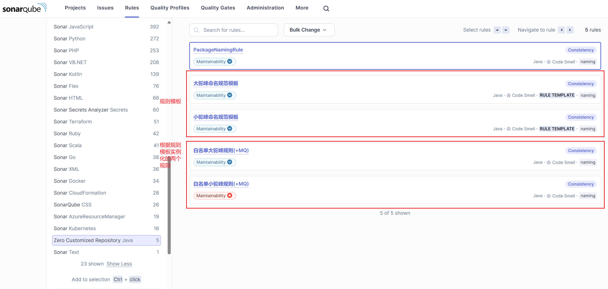

# 运行环境
采用sonar-qube的docker镜像`sonarqube`
```bash
$ docker pull sonarqube:community
$ mkdir -f sonarqube/data sonarqube/extensions sonarqube/logs sonarqube/conf
$ docker run -it -p 9000:9000 -v /x/sonarqube/data:/opt/sonarqube/data -v /x/sonarqube/logs:/opt/sonarqube/logs -v /x/sonarqube/extensions:/opt/sonarqube/extensions -v /x/sonarqube/conf:/x/sonarqube/conf --name sonarqube sonarqube:community
```

# 安装插件
> - 1、安装好插件，即将打包好的插件jar包放入sonar-qube服务部署路径的`extensions/plugins/`下。
> - 2、创建自定义质量配置，在`Quality Profiles`下创建`java`语言的质量规则。
> - 3、创建项目，在`Projects`下创建项目。
> - 4、到`Quality Profiles`下自定义的质量配置中配置项目。
> - 5、本地执行sonar扫描验证。

# 配置质量阈
该插件具备的扫描规则及模板示例：


# 本地测试
```bash
$ mvn clean verify sonar:sonar -Dmaven.test.skip=true   -Dsonar.projectKey=test   -Dsonar.projectName='Test'   -Dsonar.host.url=http://localhost:9000   -Dsonar.token=<project_token>
```

# 特性
 - [X] 自定义扫描规则插件，包括自定义规则、自定义规则模板
 - [X] 加入p3c规范扫描插件

> 参考:
> - [10.4 | Extension Guide | Developing a plugin | Plugin basics](https://docs.sonarsource.com/sonarqube/10.4/extension-guide/developing-a-plugin/plugin-basics/)
> - [java-custom-rules-example](https://github.com/SonarSource/sonar-java/blob/master/docs/CUSTOM_RULES_101.md#first-version-using-syntax-trees-and-api-basics)